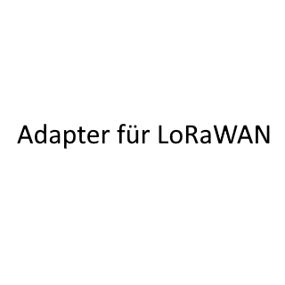

# ioBroker.lorawan

## lorawan adapter for ioBroker
The adapter communicates bidirectionally with LoraWan devices via LoRaWAN Network Server via MQTT protocol.
“The Thinks Network” and “Chirpstack” are supported now, more could follow later. 
Adapter was created in collaboration with Joerg Froehner LoraWan@hafenmeister.com

## Changelog
<!--
	Placeholder for the next version (at the beginning of the line):
	### **WORK IN PROGRESS**
-->
### 0.0.12 (2024-01-21)
* (BenAhrdt) change flow of downlink

### 0.0.11 (2024-01-20)
* (BenAhrdt) toSend und lastSend added to folders

### 0.0.10 (2024-01-19)
* (BenAhrdt) changes in length calculation

### 0.0.9 (2024-01-19)
* (BenAhrdt) first version for beta

### 0.0.8 (2024-01-18)
* (BenAhrdt) first implementation of chirpstack

### 0.0.7 (2024-01-17)
* (BenAhrdt) hex to Upper case, more units for decoded payload values

### 0.0.6 (2024-01-16)
* (BenAhrdt) insert whole translation for config and move some functions

### 0.0.5 (2024-01-15)
* (BenAhrdt) delete not configed states at startup

### 0.0.4 (2024-01-15)
* (BenAhrdt) implements buttons and standard downlink control ind json (push / replace)

### 0.0.3 (2024-01-14)
* (BenAhrdt) first config for downlinks inputed

### 0.0.2 (2024-01-12)
* (BenAhrdt) initial release

## License
MIT License

Copyright (c) 2024 BenAhrdt <bsahrdt@gmail.com>
Copyright (c) 2024 Joerg Froehner <LoraWan@hafenmeister.com>

Permission is hereby granted, free of charge, to any person obtaining a copy
of this software and associated documentation files (the "Software"), to deal
in the Software without restriction, including without limitation the rights
to use, copy, modify, merge, publish, distribute, sublicense, and/or sell
copies of the Software, and to permit persons to whom the Software is
furnished to do so, subject to the following conditions:

The above copyright notice and this permission notice shall be included in all
copies or substantial portions of the Software.

THE SOFTWARE IS PROVIDED "AS IS", WITHOUT WARRANTY OF ANY KIND, EXPRESS OR
IMPLIED, INCLUDING BUT NOT LIMITED TO THE WARRANTIES OF MERCHANTABILITY,
FITNESS FOR A PARTICULAR PURPOSE AND NONINFRINGEMENT. IN NO EVENT SHALL THE
AUTHORS OR COPYRIGHT HOLDERS BE LIABLE FOR ANY CLAIM, DAMAGES OR OTHER
LIABILITY, WHETHER IN AN ACTION OF CONTRACT, TORT OR OTHERWISE, ARISING FROM,
OUT OF OR IN CONNECTION WITH THE SOFTWARE OR THE USE OR OTHER DEALINGS IN THE
SOFTWARE.

## DISCLAIMER
The rights of the trademarks and company names,
remain with their owners and have no relation to this adapter.
The fairuse policy must continue to be adhered to by the operator of the adapter.
If this repository is forked, it must be cited as the source.